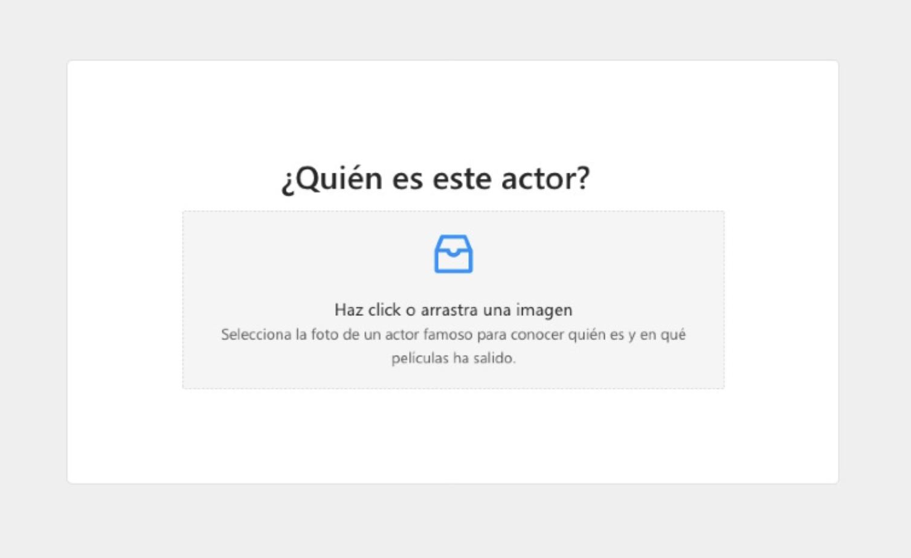
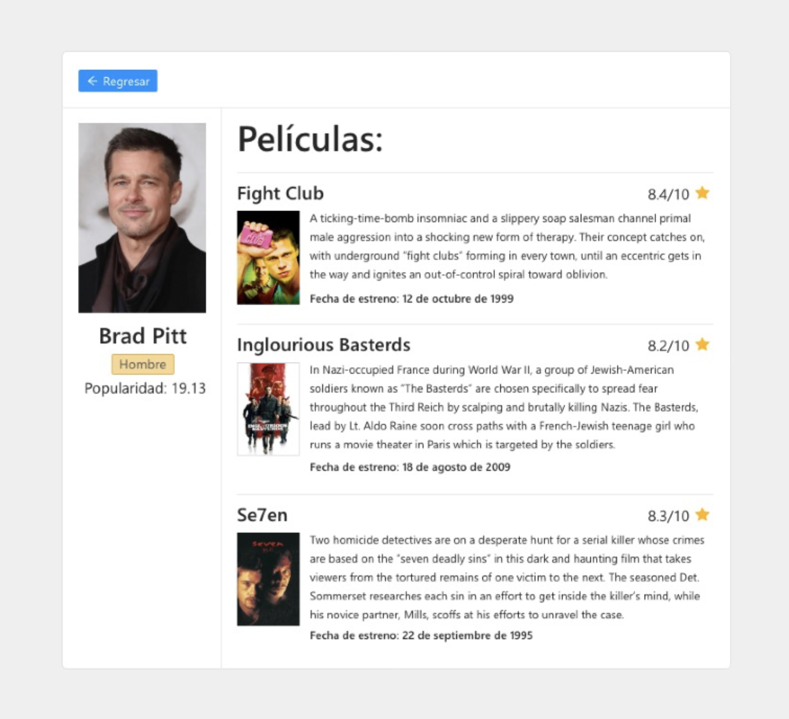

# Reto Nomada

## Problema:

No saber cómo se llama un actor ni las películas en las que ha trabajado, sólo cuentas con una foto.

## Solución solicitada:

Crear una interfaz hecha con react que conecte varias APIs para lograr saber como se llama un actor y sus películas. Tendrás que hacer dos peticiones, una para saber que actor es el de una imagen y después buscar por el nombre los datos de este.

<p align='left'>
    
</p>

\*Con ayuda de un sistema de diseño como ant o material design crear una interface similar.

\*Debo poder arrastrar un archivo de imagen o poder elegirlo desde el explorador de archivos del sistema.

\*Solo debo poder arrastrar o seleccionar un archivo.

\*Solo debe aceptar archivos de imagen tipo jpg o png, la extensión puede estar en mayusculas o minúsculas, debes aceptar ambas.

\*Primero debes subir la imagen a nuestra API para obtener el nombre del actor que aparece en la imagen.

\*Una vez tengas el nombre del actor debes consultar la API de “The movie Database”.

<p align='left'>
    
</p>

\*Dibujar la información de la izquierda:

- Foto del actor.
- Género del actor.
- Nombre del actor.
- Popularidad.
- Películas en las que ha participado:
  - Nombre de la película.
  - Foto de la película.
  - Descripción de la película.
  - Fecha en la que se estrenó.
  - Valoración de la película.

\*Debe haber un botón para reiniciar el proceso. (El diseño de la izquierda es sugerido, si no quieres no se tiene que ver así)

## Puntos extra:

- Guardar el estado de la aplicación en redux.
- Usar react-router para las dos vistas.

## Conocimientos requeridos:

- Saber hacer peticiones a APIs y subir archivos.
- Saber React
- Saber manejar Ant design o Material design.
- Entender los eventos del navegador como drag-and-drop.

## Links que serán de gran ayuda:

- Agregar Ant design a un proyecto creado con create-react-app: https://ant.design/docs/react/use-with-create-react-app
- Resumen de todos los componentes de ant: https://ant.design/components/overview/
- Componente drag-and-drop y carga de archivos: https://ant.design/components/upload/#components-upload-demo-drag
- Documentación de la API para buscar información de un actor por nombre: https://developers.themoviedb.org/3/search/search-people
- Documentación de las rutas de las imágenes: https://developers.themoviedb.org/3/getting-started/images

## Agregados personales:

- React-router-dom
- Redux-toolkit
- Historial de busqueda para evitar solicitudes repetidas

## Instalación:

- crear un archivo llamado: `.env` que tenga la siguiente forma:

```
REACT_APP_API_WHOIS_KEY = ELVALORDETUKEY
REACT_APP_API_WHOIS_URL = https://whois.nomada.cloud/upload
REACT_APP_API_MOVIEDB_PERSON = https://api.themoviedb.org/3/search/person
REACT_APP_API_MOVIEDB_IMG = https://image.tmdb.org/t/p/
REACT_APP_API_MOVIEDB_KEY = ELVALORDETUKEY
```

- Reemplazar `REACT_APP_API_MOVIEDB_KEY` y `REACT_APP_API_WHOIS_KEY` con tus propias credenciales para conectarte.

- npm install
- npm start

Ingresar a [http://localhost:3000](http://localhost:3000) para ver la app.
